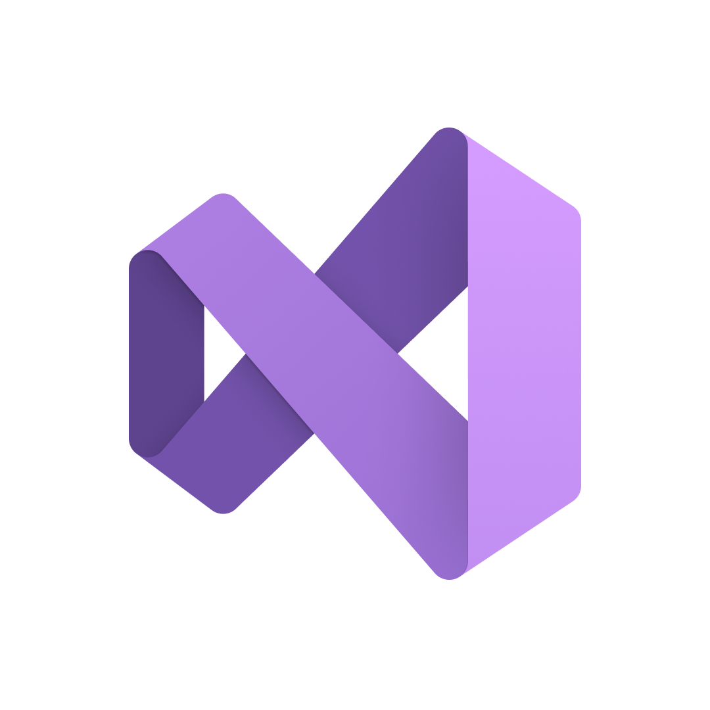

<h1 align="center"> BAKLAVA <h1>

## 📋 Table of contents
  - [Description](#description)
  - [Technologies](#technologies)
  - [Documentation](#docs)
  - [How to run](#install)
  - [Collaborators](#collaborators)

## 🔍 Description <a name="description"></a>
A tower defense game where you need to solve mathematical equations to kill enemies.

## 🖥️ Technologies used <a name="technologies"></a>
### IDE & version control system:

<a href="https://visualstudio.microsoft.com/vs/"></a>
<a href="https://github.com/"></a>
<a href="https://git-scm.com/"></a>

### Programming languages & third-party libraries:

<a href="https://cplusplus.com/"></a>
<a href="https://www.raylib.com/index.html"> </a>

### Tools used for documantation, presentation & communication:

<a href="https://www.microsoft.com/en-ww/microsoft-365/word?activetab=tabs%3afaqheaderregion3"></a>
<a href="https://www.microsoft.com/en-ww/microsoft-365/powerpoint"></a>
<a href="https://www.microsoft.com/en-ww/microsoft-365/excel"></a>

## 📃 Documentation <a name="docs"></a>
### Code & Team Documentation

### QA Documentation

### Presentation

## 🚀 How to run <a name="install"></a>
*The following instructions are going to show you how to set up the project*

### Get the release from the releases page.
Download the latest release from the releases page and run the exe file

### Compile from source
- Prerequisites
  - [Visual Studio](https://visualstudio.microsoft.com/vs/) with C++ compiler
  - [Git](https://git-scm.com/)
- Installation
1. Clone the repo.
```
git clone https://github.com/SGSkuliev21/baklava.git
```
2. Open the solution file with Visual Studio
3. Compile the project by hitting CTRL + F5 key combination

## 🧑 Collaborators <a name="collaborators"></a>
- [Stoyan Skuliev](https://github.com/SGSkuliev21) - Scrum trainer
- [Ivan Stoychev](https://github.com/IYStoychev21) - Back-end Developer
- [Stoyan Ivanov](https://github.com/SDIvanov21) - Front-end Developer
- [Ivelin Bozhilov](https://github.com/IIBozhilov21) - QA Engineer
